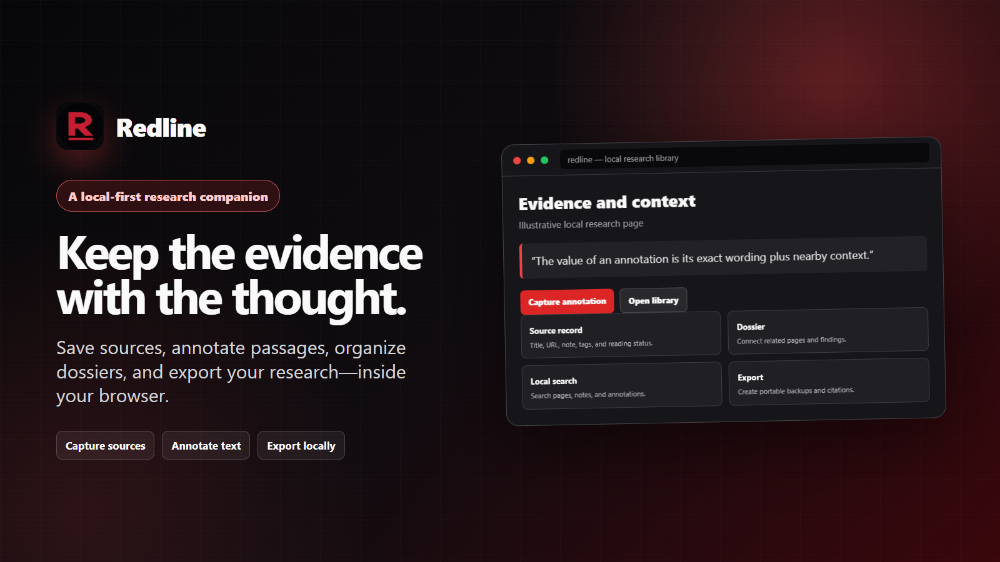

<div align="center">
  
  <h1>Redline</h1>
  <p><strong>Annotate the web. Keep the evidence.</strong></p>
  <p>The public home for Redline documentation, privacy information, and support.</p>
  <p>
    <a href="https://theanarchox.github.io/redline-support/"><strong>Homepage</strong></a>
    ·
    <a href="https://theanarchox.github.io/redline-support/docs/"><strong>Documentation</strong></a>
    ·
    <a href="https://theanarchox.github.io/redline-support/support.html"><strong>Get support</strong></a>
    ·
    <a href="https://chromewebstore.google.com/detail/godhepkljlddjobglmnkpcbohljhnmok"><strong>Chrome Web Store</strong></a>
    ·
    <a href="https://addons.mozilla.org/en-US/firefox/addon/redline-rl/"><strong>Firefox Add-ons</strong></a>
    ·
    <a href="https://github.com/TheAnarchoX/redline-support/issues/new/choose"><strong>Report an issue</strong></a>
  </p>
</div>



> [!IMPORTANT]
> **Redline is closed-source proprietary software.** This repository contains its public website and documentation, not the application source code, and does not grant a license to the Redline product.

## What you will find here

- A dependency-free, multi-page [product website](https://theanarchox.github.io/redline-support/).
- Searchable [documentation](https://theanarchox.github.io/redline-support/docs/) covering capture, source history and comparison, annotations, dossiers, the Evidence Compiler, search, backups, imports, exports, browser support, troubleshooting, FAQs, and releases.
- A [support page](https://theanarchox.github.io/redline-support/support.html) with a local-only environment summary builder for preparing public-safe bug context.
- Privacy-aware forms for [bugs, feature requests, and documentation issues](https://github.com/TheAnarchoX/redline-support/issues/new/choose).
- The public [privacy policy](https://theanarchox.github.io/redline-support/privacy.html) and private [security-reporting guidance](SECURITY.md).

## Preview locally

No build step is required. Serve the repository root over HTTP:

```powershell
python -m http.server 8000
```

Then open `http://localhost:8000/`. Opening files directly also works for most pages, but HTTP preview matches GitHub Pages more closely.

Documentation search and the support summary builder require JavaScript. Navigation and all documentation remain readable without it.

### Versioned documentation

Stable `/docs/` URLs always describe the latest Redline release, currently 1.0.3. Complete historical snapshots are checked in under `/docs/v1.0.2/`, `/docs/v1.0.1/`, and `/docs/v1.0.0/`, with a release selector at the top of each documentation table of contents and the overview search panel.

After editing the latest docs or adding a release baseline, regenerate the checked-in selectors, historical pages, search indexes, and sitemap before validation:

```powershell
node scripts/generate-versioned-docs.mjs
```

The historical generator reads the baseline commits recorded in the script, so a full Git history is required when regenerating snapshots.

### Validate the static site

Run the dependency-free, read-only validator before publishing documentation changes:

```powershell
node scripts/validate-site.mjs
```

It checks local links, fragments, assets, duplicate IDs, current and historical documentation-search targets, version selectors, sitemap and canonical coverage, heading structure, and documentation-sidebar consistency by release.

## Deployment

The site is published directly from the root of `main` through GitHub Pages:

<https://theanarchox.github.io/redline-support/>

There is no deployment build pipeline. Versioned documentation is generated locally and checked in; a push to `main` republishes the static files as committed.

<details>
<summary><strong>Maintainer configuration</strong></summary>

### Store and repository links

Edit [`assets/js/config.js`](assets/js/config.js) if marketplace listing URLs change:

- `repositoryUrl` is the fallback used for local previews. On GitHub Pages, the repository URL is derived automatically.
- `chromeStoreUrl` and `firefoxAddonsUrl` power the homepage marketplace buttons.

If the repository owner or name changes, also update the fixed URLs in:

- `.github/ISSUE_TEMPLATE/config.yml`
- `support.html` fallbacks; runtime JavaScript corrects these automatically on GitHub Pages
- canonical, Open Graph, and Twitter metadata in every public HTML page
- `sitemap.xml` and `robots.txt`
- README examples and other fixed public links

### Publication checklist

- [ ] Confirm the public repository URL and marketplace URLs.
- [ ] Confirm the privacy-policy effective date, publisher identity, and private contact route meet your legal needs.
- [ ] Test private vulnerability reporting while signed out of the maintainer account.
- [ ] Confirm marketplace metadata describes Redline as proprietary and does not identify this repository as application source.
- [ ] Review each screenshot and policy statement against the release being published.
- [ ] Run `node scripts/validate-site.mjs` and resolve every reported error.
- [ ] Test the deployed project-path URL, not only the local root URL.

</details>

## Contributing and support

Issues and pull requests about this website and its documentation are welcome. Application source patches cannot be accepted here because the product source is not included.

Before posting publicly, remove private URLs, research text, notes, tags, dossier names, credentials, tokens, browser-profile data, and unredacted screenshots. **Never upload a Redline vault export to a public issue.**

See [SUPPORT.md](SUPPORT.md) and [SECURITY.md](SECURITY.md) for the complete reporting policy.
